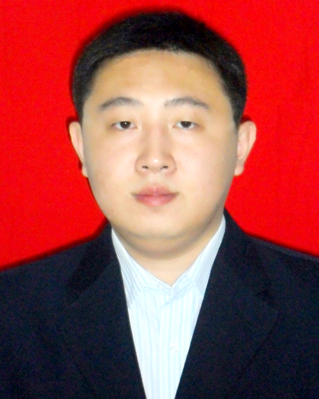

<head>
<meta name="generator" content="jemdoc, see http://jemdoc.jaboc.net/" />
<meta http-equiv="Content-Type" content="text/html;charset=utf-8" />
<link rel="stylesheet" href="jemdoc.css" type="text/css" />
<link rel="stylesheet" href="boyd.css" type="text/css" />
</head>
<body>
<table summary="Table for page layout." id="tlayout">
<tr valign="top">
<td id="layout-menu">

Yue Lu

<a href="index.html" class="current">Home</a>

<a href="teaching.html">Teaching</a>

<a href="bio.html">Biography</a>

Research

<a href="papers.html">Papers</a>

<a href="software.html">Software</a>

Classes

<a href="http://stanford.edu/class/engr108/">ENGR108</a>

</td>
<td id="layout-content">

<h1>Yue Lu</h1>

<table class="imgtable"><tr><td>
&nbsp;</td>
<td align="left">
Yue Lu 
<a href="http://sxkx.tjnu.edu.cn/">School of Mathematical Sciences</a> 
<a href="http://www.tjnu.edu.cn/">Tianjin Normal University</a>

</td></tr></table>
<h2>Contact</h2>

393 Binshui West Road, Xiqing District, Tianjin, 300387, China 
Tel: +86-22-2376-6366 
<a href="mailto:jinjin403@sina.com">jinjin403@sina.com</a> 
<a href="https://luyue-tjnu.github.io/index2">https://luyue-tjnu.github.io/index2</a>

<h2>Schedule</h2>

Teaching schedule 2020&ndash;21:
<a href="https://stanford.edu/class/engr108/">ENGR108</a> (formerly known as 
<a href="https://ee103.stanford.edu">EE103/CME103</a>) 
(Autumn). 

<h2>Summary of my research</h2>

My research interest lies in the broad field of large scale computational optimization  with  applications in science and engineering. The size and complexity of these problems have posed significant challenges to high performance computing. My research focuses on the study of the theoretical and computational aspects of both general optimization algorithms and special purpose methods that take advantage of problem structure.

<h2>Research experience &amp; Education</h2>
<ul>
<li>
<b>Lecturer</b> 
Tianjin Normal University, Tianjin, China

</li>
<li>
<b>Postdoc</b> (2017.9-2018.8) 
Department of Mathematics, National Taiwan Normal University, Taipei

</li>
<li>
<b>Assistant</b>(2010.8-2011.6) 
Tianjin University RenAi College, China

</li>
<li>
<b>Ph.D in Operations Research and Control Theory</b> (2011.9-2015.6) 
School of Mathematical Sciences, Dalian University of Technology, Dalian, China

</li>
<li>
<b>M.S in Computational Mathematics</b> (2007.9-2010.6) 
School of Mathematical Sciences, Soochow University, Suzhou, China

</li>
<li>
<b>B.S in Information and Computational Science</b> (2003.9-2007.6) 
School of Mathematical Sciences, Soochow University, Suzhou, China

</li>
</ul>

</body>
</html>
